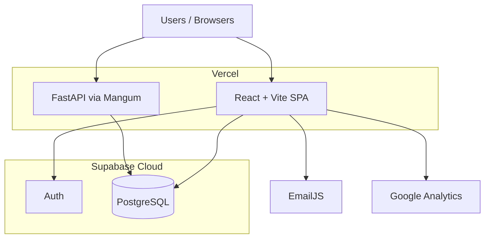

# Rethink Carbon — Current Architecture (AWS Consultancy Brief)

**Audience:** AWS consultancy / migration partner  
**Purpose:** High-level view of today’s production-shaped stack (from application code)  
**Target domain:** rethinkcarbon.io  

---

## 1. One-line summary

**React/Vite SPA on Vercel** + **FastAPI calc API on Vercel (Mangum)** + **Supabase Auth + PostgreSQL** as system of record. Client-side PDF and EmailJS. **No AWS runtime in application code today.**

---

## 2. Context diagram

### Request paths
| Path | What happens |
|------|----------------|
| Marketing / app UI | Browser loads SPA from Vercel CDN/static |
| Login / CRUD | SPA ↔ Supabase Auth + Postgres (JS client) |
| Finance / scenario calc | SPA → Vercel Python function (FastAPI) → may use Supabase service role |
| Contact email | SPA → EmailJS |
| PDF reports | Generated in-browser (jsPDF) |

---

## 3. Technology inventory

| Layer | Technology |
|-------|------------|
| Frontend | React 18, TypeScript, Vite 5, Tailwind, React Router, React Query, Framer Motion |
| Hosting | Vercel (SPA + Python serverless) |
| Backend API | FastAPI (Mangum) — `/finance-emission`, `/facilitated-emission`, `/scenario/calculate` |
| Database | Supabase PostgreSQL (migrations under `supabase/migrations`) |
| Auth | Supabase Auth (session, invite, password reset) |
| Storage / Realtime / Edge Functions | Not used in this codebase |
| Email | EmailJS |
| Reporting | Client-side jsPDF + html2canvas |
| Analytics | Google Analytics |

---

## 4. Product domains (application surface)

- Marketing site (landing, solutions modules, pricing, contact)
- Scope 1–3 / UK / EPA–IPCC carbon accounting
- Financed & facilitated emissions (PCAF-style) → FastAPI
- Bank portfolio
- Climate risk / scenario building → FastAPI
- ESG management + readiness
- Explore / CCUS / BESS / markets
- Admin, organizations, RBAC

---

## 5. Suggested AWS mapping (discussion only)

| Current | Typical AWS counterpart |
|---------|-------------------------|
| Vercel SPA | S3 + CloudFront (or Amplify) |
| Vercel FastAPI | API Gateway + Lambda, or ECS/Fargate / App Runner |
| Supabase Auth | Amazon Cognito |
| Supabase Postgres | Amazon RDS / Aurora PostgreSQL |
| EmailJS | Amazon SES |
| Secrets | Secrets Manager / SSM |
| Observability | CloudWatch + X-Ray |

---

## 6. Notes for the AWS partner

1. Frontend currently embeds Supabase URL/anon key in client code — config hygiene should be part of cutover.  
2. CORS is locked to rethinkcarbon.io / Vercel preview origins.  
3. Substantial SQL migration history — Postgres migration is a primary workstream.  
4. No Docker setup in-repo today.  
5. Legal docs may mention AWS; **runtime evidence in code is Vercel + Supabase**.

---

*Generated from the Rethink Carbon `carbon-credit-app` repository for consultancy onboarding.*
