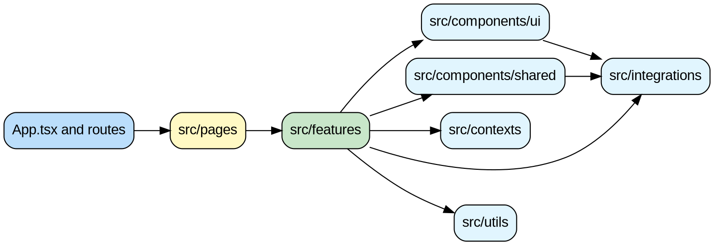

# Feature Boundary Diagram

## Purpose

This file shows where code should live and where the boundaries are between routes, features, and shared platform code.

## Boundary view

Paste this into Graphviz Online:



## Simple rule

```txt
pages
  ↓
features
  ↓
shared platform
```

## What each boundary means

### `pages -> features`

Allowed and preferred.

Route files should call into features.

### `features -> shared platform`

Allowed and preferred.

Features should use:

- shared UI
- shared contexts
- shared integrations

### `shared -> features`

Avoid this.

Shared code should not depend on business-specific feature code.

## Scope 3 boundary example

Current transitional boundary:

```txt
UKCalculatorScreen
  ↓
components/emissions/scope3/Scope3Section
  ↓
features/emission-calculator/scope3/categories/*
```

Target boundary:

```txt
UKCalculatorScreen
  ↓
features/emission-calculator/scope3/Scope3Shell
  ↓
feature hooks + adapters + categories
```

## Best practices

- if it has clear business ownership, prefer `features/`
- if it is truly generic, keep it shared
- do not hide feature logic in generic-looking folders

## Navigation

- Back: [`scope3-flow.md`](./scope3-flow.md)
- Related: [`../folder-structure.md`](../folder-structure.md)
