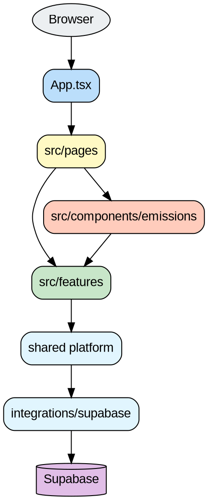
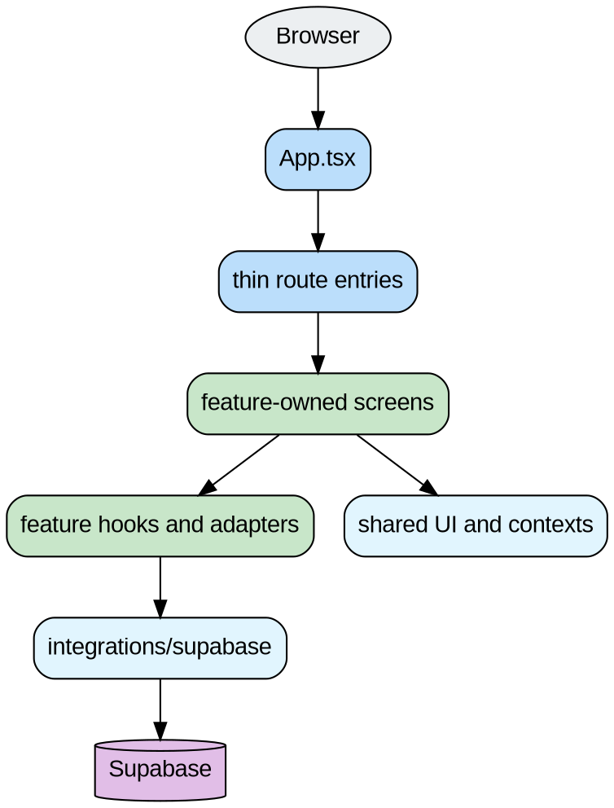

# High-Level Architecture Diagram

## Purpose

This file gives a quick picture of how the frontend is structured today and where the architecture is heading.

## Current high-level view

Paste this into Graphviz Online:



## What this means

- `App.tsx` still owns routes
- `pages/` still acts as a route adapter layer
- `features/` is the main home for business logic
- `components/emissions/` still contains a migration bridge, especially for Scope 3

## Current architecture in plain words

```txt
Browser
  ↓
App.tsx
  ↓
pages/
  ↓
features/
  ↓
shared platform
  ↓
Supabase
```

With one important bridge:

```txt
UKCalculatorScreen
  ↓
Scope3Section
  ↓
feature-owned Scope 3 category components
```

## Target high-level view

Paste this into Graphviz Online:



## Best practices

- routing stays thin
- features own behavior
- shared platform stays generic
- legacy bridge layers should shrink over time

## Navigation

- Back: [`../README.md`](../README.md)
- Next: [`scope3-flow.md`](./scope3-flow.md)
