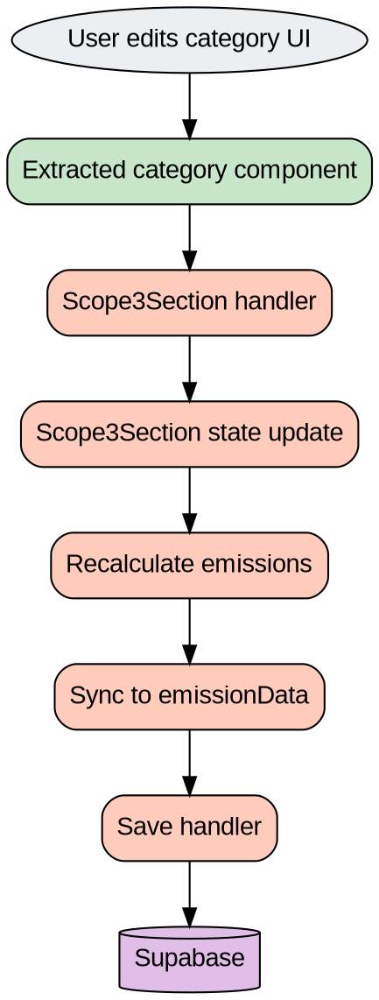
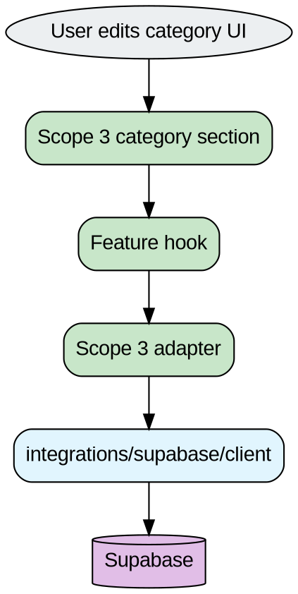

# Scope 3 Flow Diagram

## Purpose

This file shows how Scope 3 works today and what the target flow should be later.

## Current Scope 3 flow

Paste this into Graphviz Online:



## Current real paths

```txt
features/emission-calculator/scope3/categories/*
  ↓ props + callbacks
components/emissions/scope3/Scope3Section.tsx
  ↓
supabase.from(...)
```

## Current detailed picture

```txt
Presentational section
  ↓
onUpdateRow / onAddRow / onSave
  ↓
Scope3Section
  ├─ owns rows
  ├─ owns saving flags
  ├─ owns load/save logic
  ├─ owns useEmissionSync
  └─ writes to Supabase
```

## Target Scope 3 flow

Paste this into Graphviz Online:



## Target detailed picture

```txt
Category UI
  ↓
category hook
  ↓
adapter
  ↓
Supabase
```

## Why this target is better

- UI stays simple
- save/load logic is easier to test
- data access is easier to reuse
- one huge orchestrator becomes smaller

## Navigation

- Back: [`high-level-architecture.md`](./high-level-architecture.md)
- Next: [`feature-boundary.md`](./feature-boundary.md)
- Related: [`../emission-calculator/scope3.md`](../emission-calculator/scope3.md)
